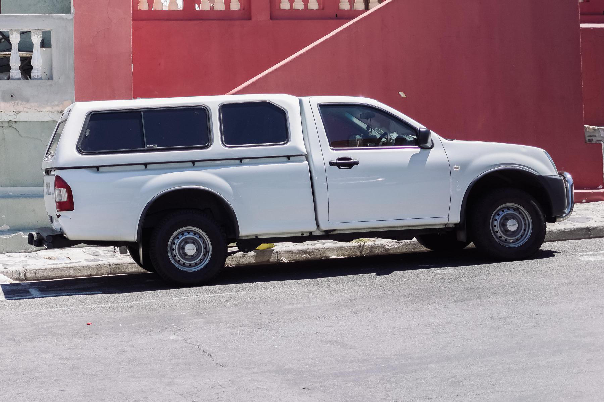
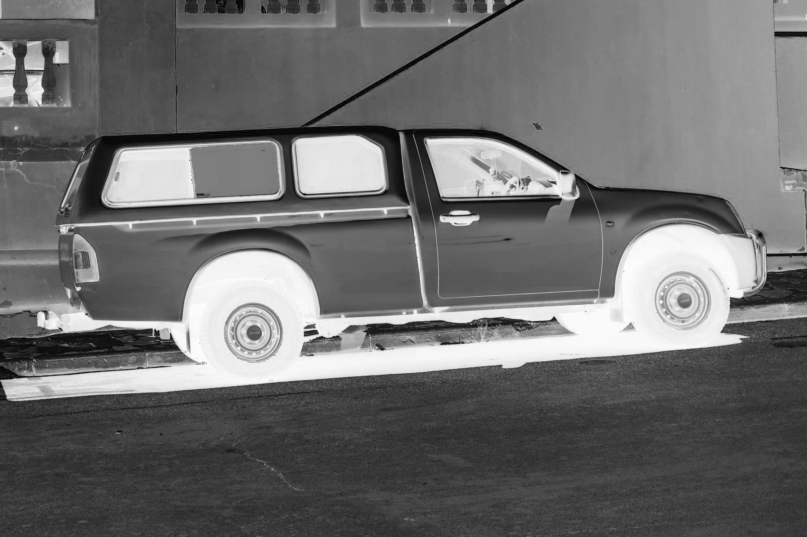

# SAM Interactive System - 功能演示

## 项目概述

**SAM Interactive System** 是基于 Facebook Research 的 **Segment Anything Model (SAM)** 构建的智能图像识别、分割、检测交互系统。

用户只需在图片上**点击一下**或**画个框**，SAM 就能自动识别并精确分割出目标物体。

---

## 功能演示 (卡车图片)

### 1. 原图



- 图片尺寸: 1800 x 1200 像素
- 内容: 一辆红色卡车

### 2. 点击分割



**操作**: 在卡车中心位置 (500, 375) 点击一下

**结果**:
- 置信度: 98.23%
- 分割面积: 21,571 像素
- 自动识别出完整卡车轮廓

### 3. 分割掩码


**说明**: 黑白掩码图，白色区域 = 分割出的目标

可用于:
- 图像抠图
- 背景替换
- 目标提取

### 4. 自动检测


**操作**: 点击"自动检测"按钮

**结果**: 自动检测出 15 个不同区域
- 检测到卡车、天空、路面、阴影等多个区域
- 每个区域用不同颜色标记
- 自动识别区域类型 (暖色物体、天空/墙面等)

### 5. 自动分割


**操作**: 点击"自动分割"按钮

**结果**: 自动分割出 15 个物体，每个物体有独立掩码和边界框
- 不同颜色标记不同物体
- 显示边界框
- 每个物体可单独导出

### 6. 图像识别

**识别结果**:
| 属性 | 值 |
|------|------|
| 场景 | 正常光照 / 多彩场景 |
| 亮度 | 135.8 |
| 对比度 | 67.3 |
| 图片尺寸 | 1800 x 1200 |

---

## 对比图


从左到右: **原图** → **点击分割** → **掩码** → **自动检测** → **自动分割**

---

## 四大核心功能

### 识别 (Recognition)
- 分析图像场景类型
- 计算亮度、对比度
- 提取主色调

### 分割 (Segmentation)
- 点击分割: 左键=前景, Shift+左键=背景
- 框选分割: 拖拽画框
- 精确到像素级别

### 检测 (Detection)
- 自动检测图中所有物体
- 网格采样 + SAM 推理
- 输出每个区域的边界框、面积、类型

### 自动分割 (Auto Segmentation)
- 一键检测并分割所有物体
- 每个物体独立掩码和边界框
- 不同颜色标记
- 支持单个物体导出

---

## 使用方式

```bash
# 启动系统
cd sam-interactive-system
./start.sh

# 访问前端
http://localhost:5174
```

## 技术栈

| 组件 | 技术 |
|------|------|
| AI 模型 | SAM ViT-B (Facebook Research) |
| GPU 加速 | CUDA (RTX 3060) |
| 后端 | FastAPI + Python |
| 前端 | React + Vite + Canvas API |

---

## 文件说明

```
demo/
├── 01_original.png      # 原图
├── 02_segmentation.png  # 点击分割效果
├── 03_mask.png          # 分割掩码
├── 04_detection.png     # 自动检测效果
├── comparison.png       # 对比拼图
└── DEMO.md              # 本文档
```
