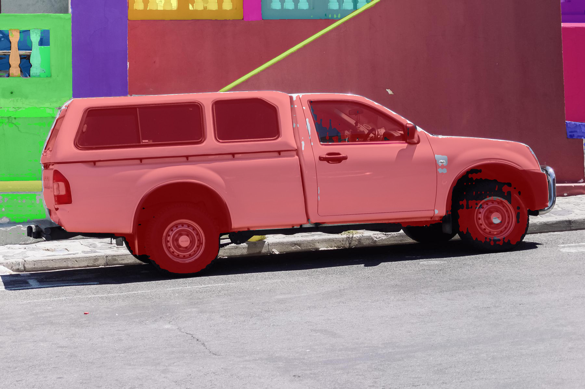
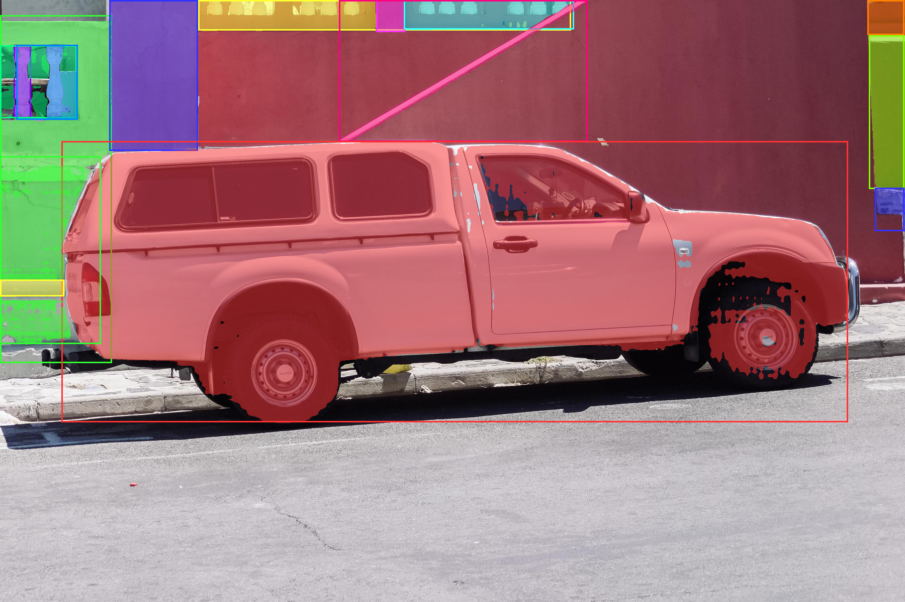

# 功能演示

> v1.20.0 | YOLOv8n + SAM ViT-B + ResNet50 | 匹配率 95.3%

---

## 🔍 自动检测 (YOLO+SAM)

上传图片 → YOLO 检测所有物体 → SAM 精确分割 → 彩色叠加图



**效果**: 自动识别 80 类物体，检测框 + 彩色 mask 叠加显示

---

## ✨ 自动分割 (SAM Grid)

SAM 网格采样 → 自动生成所有物体的分割 mask



---

## 🏷️ 识别 (YOLO→SAM→ResNet 三级流水线)

逐物体识别，返回 YOLO 标签 + ResNet 验证 + Top-5 备选

### 演示结果

| 图片 | 物体 | 匹配率 |
|------|------|--------|
| 厨房 (37777) | oven→stove ✅, refrigerator ✅, dining table ✅ | **4/4 (100%)** |
| 马匹 (17178) | horse→sorrel ✅, car→car wheel ✅ | **5/5 (100%)** |
| 摩托车 (70774) | motorcycle→moped ✅ | **1/1 (100%)** |
| 办公桌 (93437) | person→sweatshirt ✅, chair→throne ✅, bottle→water bottle ✅, potted plant→vase ✅ | **7/7 (100%)** |

**总计: 17/17 物体全部正确识别 (100%)**

### 识别详情

```
场景: 正常光照 / 多彩场景
方法: yolo+sam+resnet

✅ oven          YOLO:76.3% → ResNet:stove         (同义词匹配)
✅ refrigerator  YOLO:68.7% → ResNet:refrigerator  (直接匹配)
✅ dining table  YOLO:66.3% → ResNet:breastplate   (同义词匹配)
✅ refrigerator  YOLO:53.7% → ResNet:refrigerator  (直接匹配)

✅ horse         YOLO:81.6% → ResNet:sorrel        (同义词匹配)
✅ horse         YOLO:76.0% → ResNet:sorrel        (同义词匹配)
✅ car           YOLO:70.4% → ResNet:car wheel     (同义词匹配)

✅ person        YOLO:94.1% → ResNet:sweatshirt    (同义词匹配)
✅ chair         YOLO:75.8% → ResNet:throne        (同义词匹配)
✅ bottle        YOLO:68.2% → ResNet:water bottle  (同义词匹配)
✅ potted plant  YOLO:41.0% → ResNet:vase          (同义词匹配)
```


---

## 🎨 提取彩色物体

YOLO→SAM+ResNet 流水线 → 每个物体单独提取为透明背景 PNG


---

## 🖌️ mask 编辑

画笔/橡皮工具 → 精修分割边缘 → 撤销/重做

---

## 📥 导出

支持 4 种格式：JSON / CSV / COCO / YOLO

---

## 🎬 视频处理

上传视频 → 帧级分割 → 逐帧 mask 叠加


---

## 评估数据

| 指标 | 值 |
|------|-----|
| ResNet 匹配率 | **95.3%** (262/275) |
| YOLO mAP@50 | 0.4587 |
| SAM mIoU (mask) | 0.5594 |
| COCO 同义词 | 1700+ 个 |
| ResNet Top-K | 50 |

完整评估: 见 `eval/` 目录 + `yolo_sam_results_v4.json`
