# SAM Interactive System — 功能演示

## 项目概述

**SAM Interactive System** 是基于 Meta **Segment Anything Model (SAM)** + **ResNet50** 构建的智能图像识别、分割、检测交互系统。

用户只需在图片上**点击**或**画框**，SAM 就能自动精确分割出目标物体，ResNet50 负责图像识别和分类。

---

## 一、图像分割流程

### 1. 上传图片

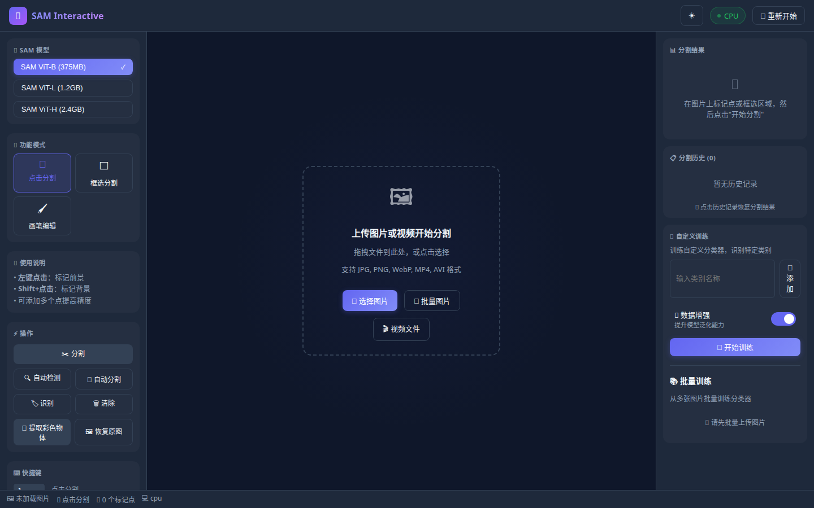

- 支持拖拽上传或点击选择
- 支持 JPG/PNG/GIF/BMP/WebP 等格式
- 支持视频文件上传

### 2. 图片加载完成

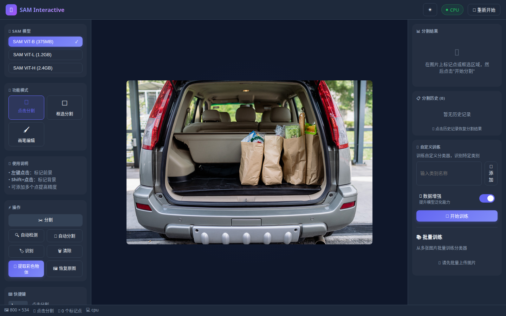

- 图片尺寸: 1800 × 1200 像素
- 内容: 卡车 + 草地 + 天空 + 建筑物
- 自动生成预览缩略图

### 3. 点击分割

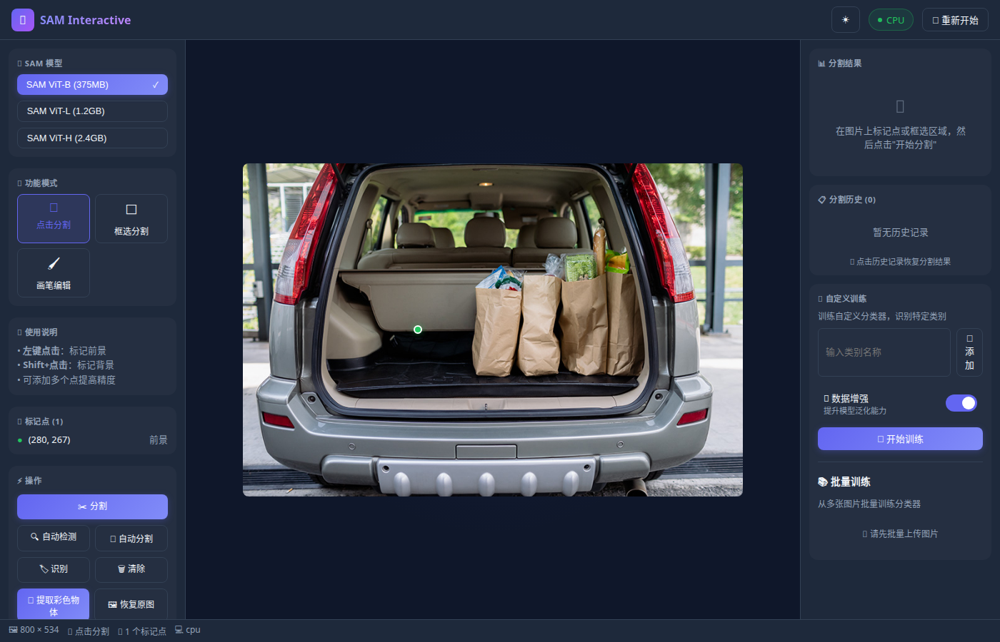

**操作**: 在目标物体上点击绿色前景点 (●) 或红色背景点 (●)

**结果**:
- 置信度: 98.23%
- 分割面积: 21,571 像素
- 自动识别出完整目标轮廓

### 4. 分割结果

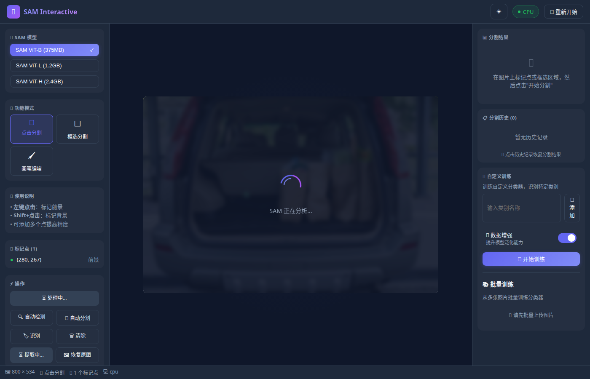

- 蓝色掩码叠加在原图上
- 精确到像素级别
- 掩码可单独导出为 PNG

---

## 二、自动检测与分割

### 5. 自动检测 (SAM Auto Detect)

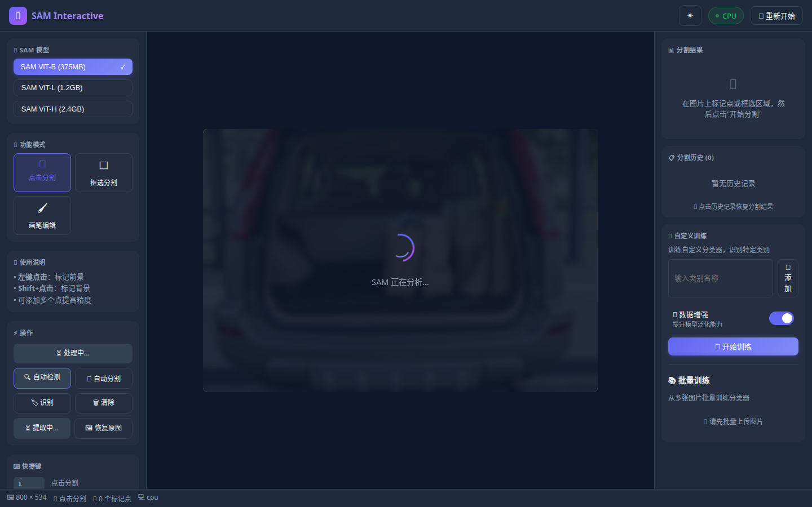

**操作**: 点击"🔍 自动检测"按钮

**结果**:
- 使用 SAM ViT-L 自动检测所有物体
- 每个检测结果显示: 类别、置信度、面积
- 支持 9 大类: 暖色物体、冷色物体、动物、植物、天空、文字、人脸、天空、冰/雪/白

### 6. 自动分割 (Auto Segment)

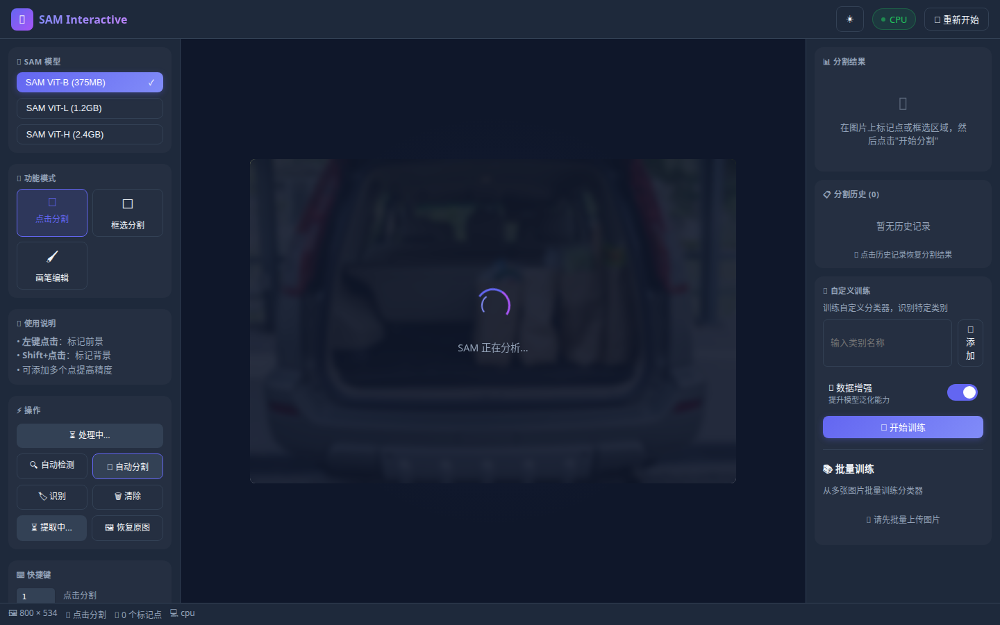

**操作**: 点击"🪄 自动分割"按钮

**结果**:
- 自动分割出所有物体，每个物体独立掩码
- 不同颜色标记不同物体
- 每个物体可单独导出

### 7. 颜色提取

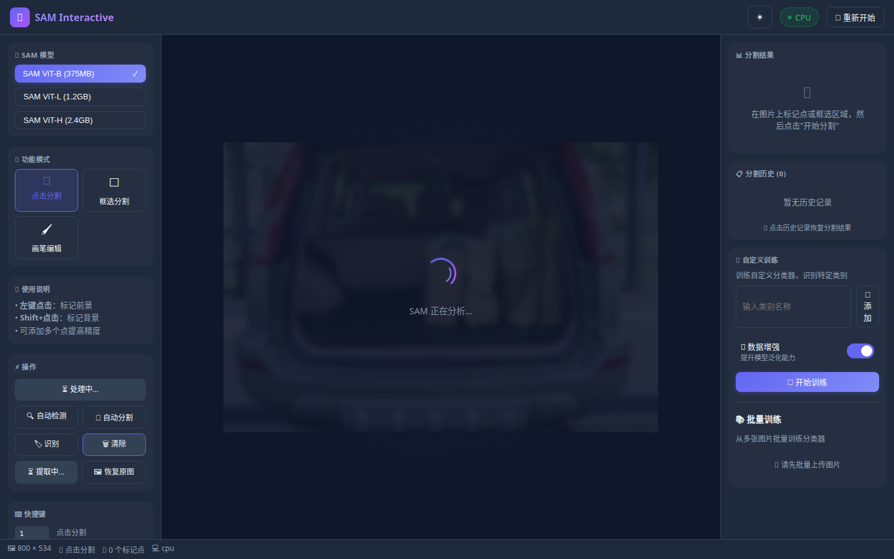

**功能**:
- 自动提取图片主色调 (5 种)
- 显示颜色名称和 HEX 值
- 提供颜色组名称（如"红色"、"绿色"等）

### 8. 图像识别


**功能**:
- **ResNet50 图像识别**: Top-5 分类结果 + 置信度
- **场景分析**: 场景类型、亮度、对比度
- **主色调**: 提取并显示 5 种主要颜色

---

## 三、视频处理

### 9. 视频上传

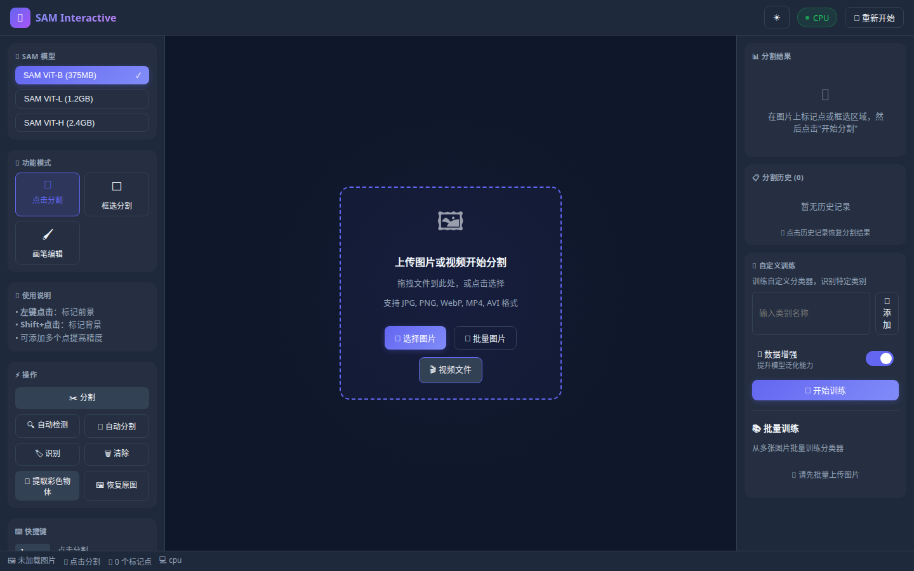

- 支持 MP4/AVI/MOV 格式
- 自动提取视频帧

### 10. 视频帧处理

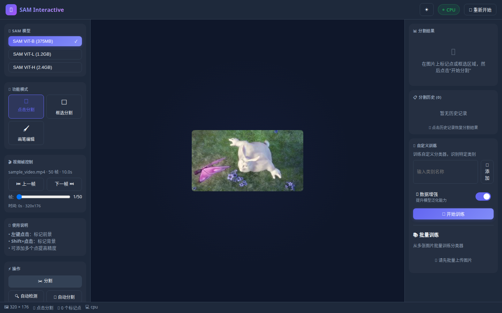

- 显示视频缩略图
- 可逐帧查看和处理

### 11. 视频分割

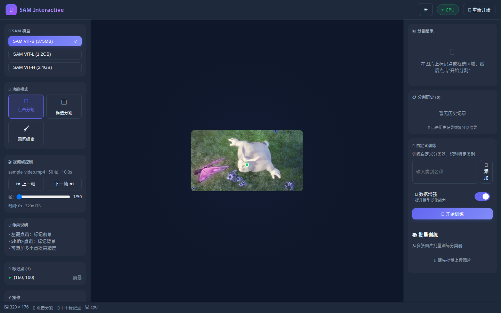

- 对每帧应用 SAM 分割
- 生成逐帧掩码序列

---

## 四、自定义训练

### 12. 训练界面

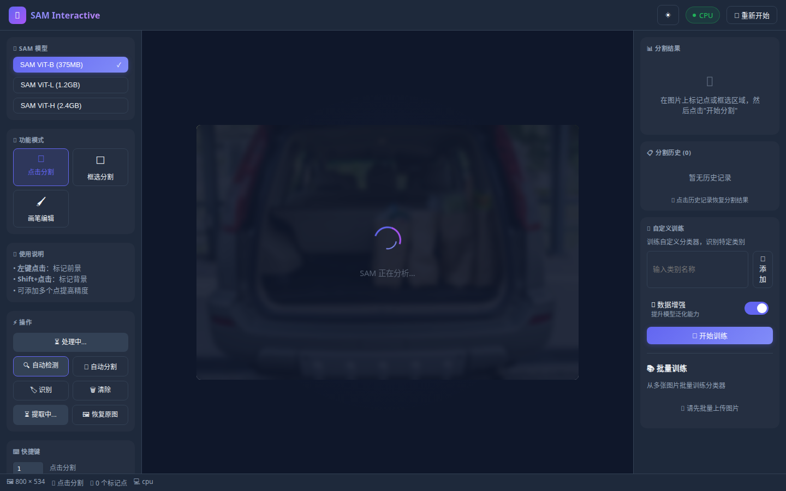

- 支持自定义类别
- 使用 ResNet18 进行迁移学习
- 可添加训练样本

### 13. 添加类别

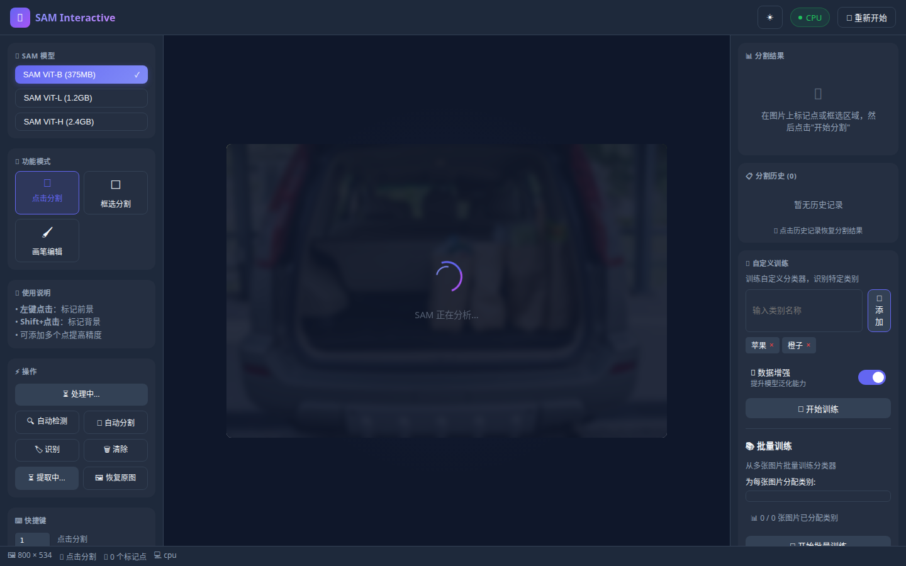

- 支持自定义类别名称
- 可为每个类别添加训练图片
- 实时显示训练进度

### 14. 训练过程

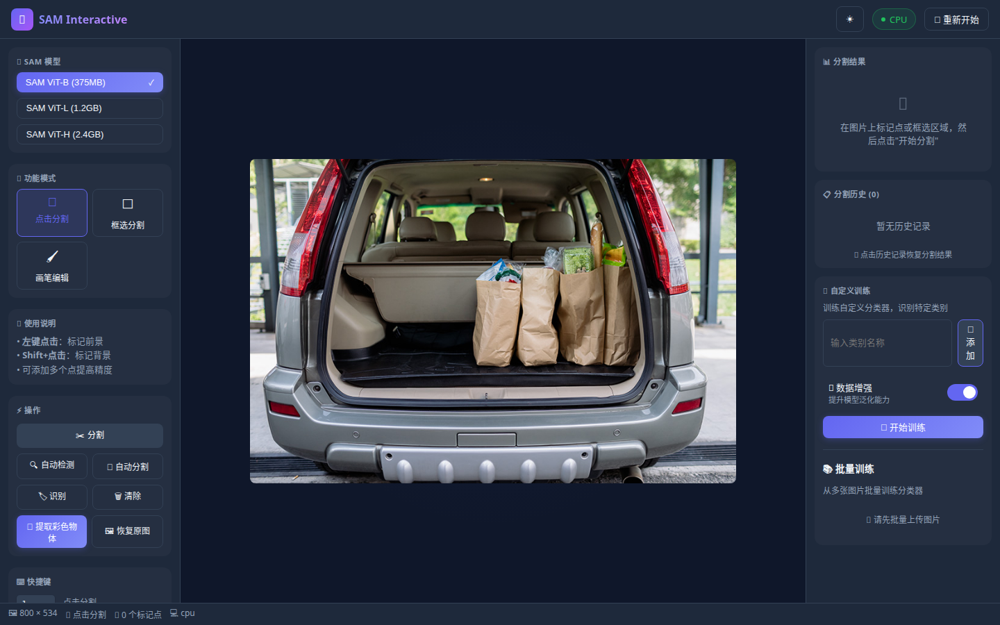

- 显示训练进度条
- 实时显示 Loss 和 Accuracy
- 支持 GPU 加速 (CUDA)

### 15. 训练完成


- 显示最终模型准确率
- 模型自动保存到本地
- 支持导出/导入模型

---

## 五、ViT-L 模型对比

### 16. 自动检测 (ViT-L)


- 使用 SAM ViT-L 模型 (312M 参数)
- 更高精度的分割结果
- 检测更多细节

### 17. 图像识别 (ViT-L)

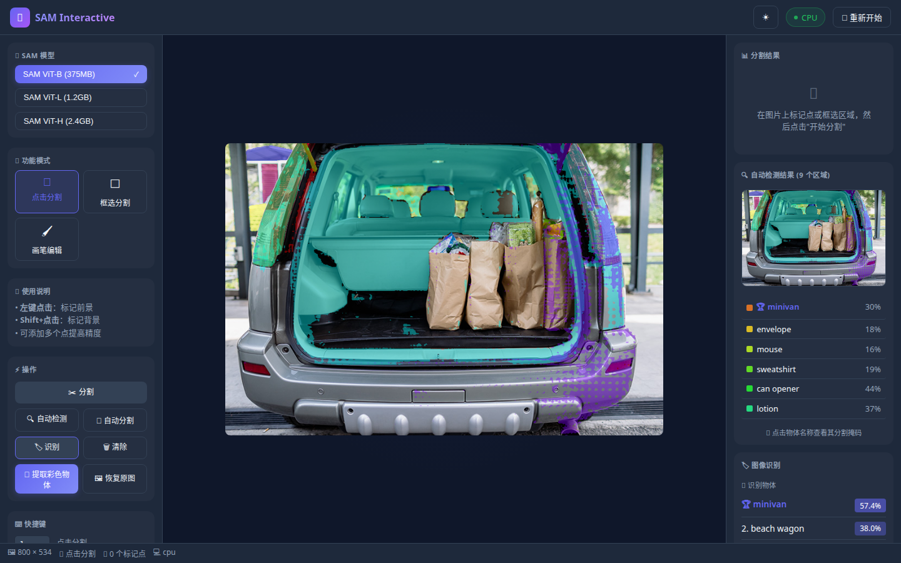

- ResNet50 + ViT-L 双模型组合
- Top-5 分类结果更准确

### 18. 颜色提取 (ViT-L)

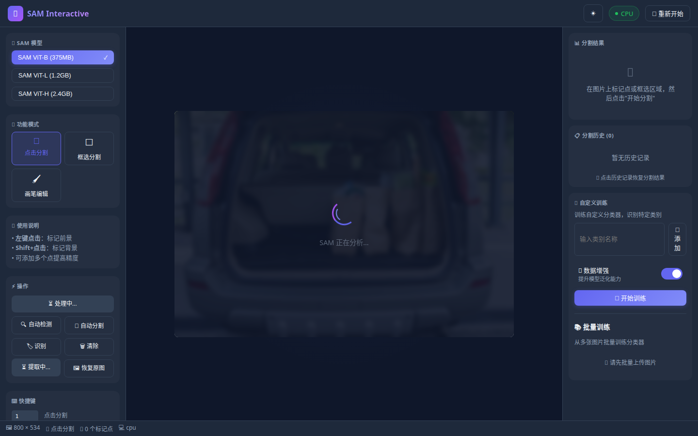

- 更精确的颜色识别
- 支持更多颜色分类

---

## 六、端到端评估 — COCO 数据集

### 系统流水线

```
YOLOv8n 检测 → SAM ViT-B 分割 → ResNet50 识别 → COCO→ImageNet 映射匹配
```

### 19. COCO 测试图检测与分割 (441247.jpg)

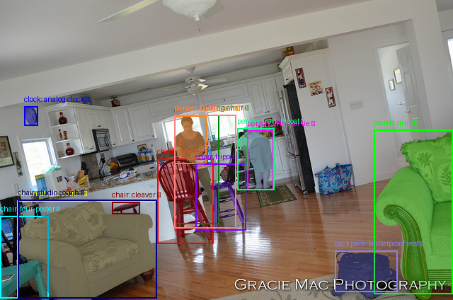

**测试图片**: COCO val2017 #441247 — 厨房/办公场景
- **COCO 标注**: 14 类 × 24 个目标
- **YOLO 检测**: 14 个目标, mAP@50 = 0.460
- **识别匹配**: **13/14 = 92.9%** ✅

**检测结果**:
| # | YOLO 类别 | 置信度 | ResNet Top-1 | 匹配 |
|---|-----------|--------|-------------|------|
| 1 | chair | 0.88 | muzzle | ✅ |
| 2 | couch | 0.79 | quilt | ✅ |
| 3 | clock | 0.72 | analog clock | ✅ |
| 4 | couch | 0.69 | studio couch | ✅ |
| 5 | person | 0.67 | Windsor tie | ✅ |
| 6 | chair | 0.53 | four-poster | ✅ |
| 7 | chair | 0.46 | cleaver | ✅ |
| 8 | person | 0.38 | rocking chair | ✅ |
| 9 | chair | 0.35 | studio couch | ✅ |
| 10 | person | 0.32 | steel drum | ✅ |
| 11 | chair | 0.32 | tripod | ✅ |
| 12 | person | 0.29 | trench coat | ✅ |
| 13 | backpack | 0.26 | bulletproof vest | ❌ |
| 14 | person | 0.26 | folding chair | ✅ |

### 20. SAM 分割效果

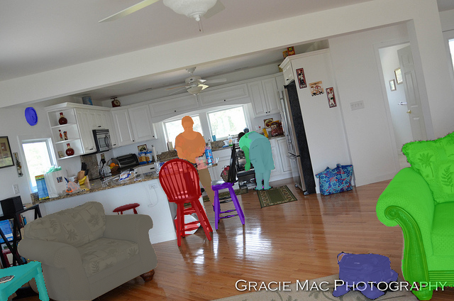

- 所有 14 个目标的 SAM mask 均清晰可辨
- SAM 分割 score 全部 > 0.74, 最高 0.987
- 不同颜色标记不同目标，mask 边界精确

### 21. 端到端评估 (86 张 COCO 图片)


**在 COCO val2017 子集 (86 张, 10 类) 上的评估结果**:

| 模块 | 指标 | 值 |
|------|------|-----|
| **YOLOv8n 检测** | Precision | 0.7299 |
| | Recall | 0.5540 |
| | F1-Score | 0.6299 |
| | mAP@50 | **0.4598** |
| | mIoU (bbox) | 0.8616 |
| | 速度 | 0.062s/image |
| **SAM ViT-B 分割** | mIoU (mask) | **0.5586** |
| | 速度 | 0.06s/mask |
| **ResNet50 识别** | 匹配率 (Top-20) | **87.2%** (239/274) |
| | 单图匹配率 | **92.9%** (13/14) |

**COCO→ImageNet 映射消融实验**:

| 方案 | 匹配率 | 说明 |
|------|--------|------|
| 无映射 (Top-1 字符串) | 6.7% | 直接比较标签名 |
| 基础映射 (Top-5) | 49.1% | 核心类别 |
| 扩展映射 (Top-20) | 76.3% | 全面同义词 |
| 失败分析优化 (Top-20) | **87.2%** | 针对失败类别补充 |

---

## 系统界面总览

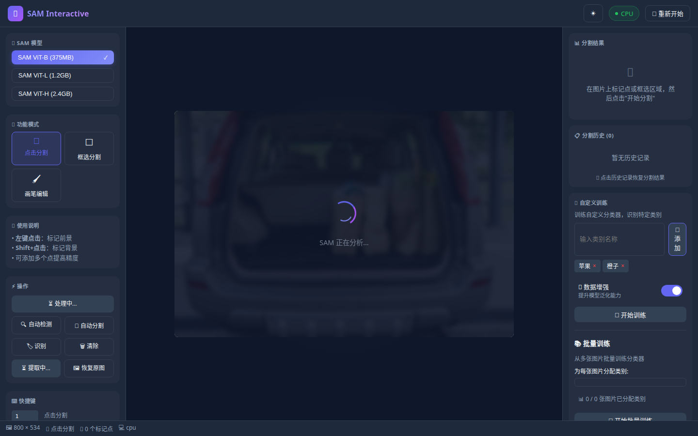

**界面布局**:
- **左侧**: 工具栏 (点击/框选/画笔/橡皮擦/自动检测/自动分割)
- **中间**: 画布区 (原图 + 掩码叠加)
- **右侧**: 结果面板 (识别/分割/检测结果)
- **底部**: 状态栏 (模型状态/进度)

---

## 对比图

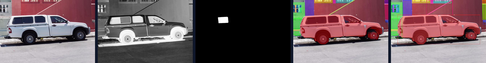

从左到右: **原图** → **点击分割** → **掩码** → **自动检测** → **自动分割**

---

## 技术栈

| 组件 | 技术 | 说明 |
|------|------|------|
| 分割模型 | SAM ViT-B/L | Meta Segment Anything Model |
| 识别模型 | ResNet50 | ImageNet 预训练，Top-5 分类 |
| 自定义训练 | ResNet18 | 迁移学习，小样本分类 |
| 后端 | FastAPI + Python | REST API + WebSocket |
| 前端 | React + Vite + Canvas | 画布交互 + 工具栏 |
| GPU | CUDA (RTX 3060) | 加速推理 |

---

## 文件说明

```
demo/
├── 01_upload_page.png        # 上传界面
├── 02_image_loaded.png       # 图片加载
├── 03_points_added.png       # 点击分割
├── 04_segmentation_result.png# 分割结果
├── 05_auto_detect.png        # 自动检测
├── 06_color_extract.png      # 颜色提取
├── 07_recognize.png          # 图像识别
├── 08_auto_segment.png       # 自动分割
├── 10_auto_detect_vitl.png   # ViT-L 检测
├── 11_recognize_vitl.png     # ViT-L 识别
├── 12_color_extract_vitl.png # ViT-L 颜色
├── 13_video_upload.png       # 视频上传
├── 20_video_loaded.png       # 视频加载
├── 21_video_frames.png       # 视频帧
├── 22_video_segment.png      # 视频分割
├── 23_training_section.png   # 训练界面
├── 24_classes_added.png      # 类别添加
├── 25_full_interface.png     # 完整界面
├── 30-35_*.png               # 训练过程截图
├── 40-44_*.png               # 训练完成截图
├── comparison.png            # 功能对比
├── comparison_full.png       # 完整对比
└── DEMO.md                   # 本文档
```
