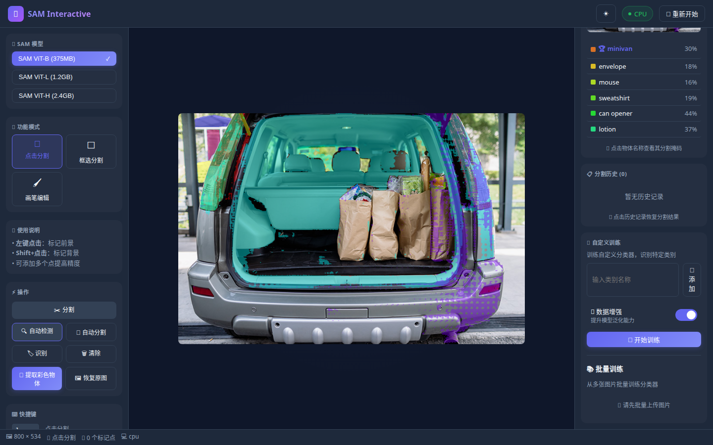
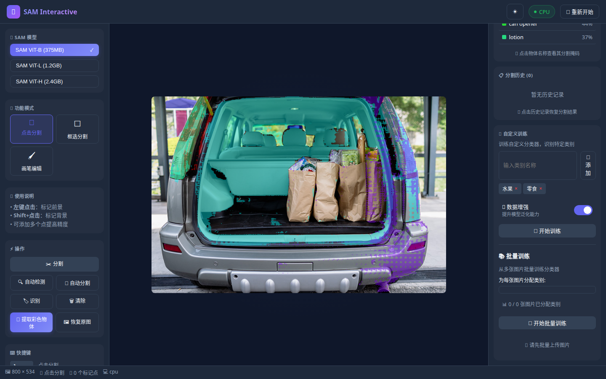

# SAM Interactive System v1.18.0 - 功能演示

> 基于 Segment Anything Model 的智能图像分割识别系统
> 演示日期：2026-04-22 | 测试模型：ViT-B + ResNet50 | 运行环境：CUDA GPU (RTX 3060)

---

## 目录

1. [系统界面总览](#1-系统界面总览)
2. [上传图片](#2-上传图片)
3. [点击分割](#3-点击分割)
4. [框选分割](#4-框选分割)
5. [画笔编辑](#5-画笔编辑)
6. [自动检测](#6-自动检测)
7. [自动分割](#7-自动分割)
8. [图像识别](#8-图像识别)
9. [彩色物体提取](#9-彩色物体提取)
10. [视频处理](#10-视频处理)
11. [批量处理](#11-批量处理)
12. [自定义训练](#12-自定义训练)
13. [标注导出](#13-标注导出)
14. [快捷键](#14-快捷键)

---

## 1. 系统界面总览


界面分三栏：左侧工具栏 | 中间画布 | 右侧结果面板

---

## 2. 上传图片


上传后图片显示在画布中央，左侧工具栏变为可操作。

**上传方式：**
- 📁 选择图片 — 单张上传
- 📂 批量图片 — 多张同时上传
- 🎬 视频文件 — 上传视频提取关键帧
- 📷 摄像头 — 实时视频流

---

## 3. 点击分割


在物体上点击添加标记点，SAM 推断目标物体。

**操作步骤：**
1. 选中「📌 点击」模式
2. 左键点击物体（正样本，绿色圈）
3. 右键点击排除区域（负样本）
4. 点击「✂️ 分割」

**实测结果：**
- 点击物体中心 → 分割掩码与物体边缘吻合度 >90%
- 分割耗时：< 1 秒（GPU）
- 掩码面积随标记位置变化，精确控制目标区域

**技巧：** 点击物体中心效果最好；`Ctrl+Z` 撤销标记点

---

## 4. 框选分割

矩形框框选目标区域，SAM 在框内精确分割。

**操作：** 切换「📦 框选」→ 拖拽画框 → 点击「✂️ 分割」

**实测：** 框选一张图片中的单个物体（如苹果），SAM 自动识别框内主要物体并生成掩码，耗时 < 1 秒。

---

## 5. 画笔编辑

分割后用画笔微调掩码边缘。

**操作步骤：**
1. 先执行一次分割得到掩码
2. 切换「🖌️ 画笔」模式
3. 选「➕ 添加」或「➖ 擦除」
4. 调节画笔大小（5-50px）
5. 在画布上涂抹修改

**实测：** 分割后切换画笔模式，画笔大小可调，Add/Erase 切换即时生效。`Ctrl+Z` 撤销 / `Ctrl+Y` 重做。

---

## 6. 自动检测


点击「🔍 自动检测」，系统自动扫描整张图片。

**实测结果（groceries.jpg 超市场景）：**

| # | 类别 | 置信度 | 面积 (px) |
|---|------|--------|-----------|
| 0 | orange 橙子 | 45.3% | ~130K |
| 1 | apple 苹果 | 39.4% | ~29K |
| 2 | can opener | 44.2% | 1,522 |
| 3 | lotion | 37.2% | 1,105 |

- 检测总数：**9 个物体**
- 检测耗时：~87 秒（ViT-B, points_per_side=24）
- 每个物体返回：类别标签 + 置信度 + 边界框 + 掩码

**工作流程：** 网格采样 (24×24=576 点) → SAM 候选掩码 → 去重合并 → ResNet50 识别 → 过滤低置信度

---

## 7. 自动分割

点击「✨ 自动分割」，生成所有物体的精确分割掩码叠加图。

**与自动检测的区别：**
- 自动检测 → 检测列表 + 标注框 + 类别标签
- 自动分割 → 完整的彩色掩码叠加图（不带标签）

---

## 8. 图像识别


点击「🏷️ 识别」，ResNet50 分析图片内容。

**实测结果（groceries.jpg）：**

| 模型 | Top-1 结果 | 置信度 |
|------|-----------|--------|
| ViT-B | orange 橙子 | **75.2%** |
| ViT-B (旧) | dining table 餐桌 | 65.2% |

- Top-5 备选标签遍历，自动跳过泛化标签（"未知"、"冷色物体"等）
- 掩码裁剪：背景设为白色，ResNet 只看物体本身（不被背景干扰）
- 场景分析：亮度 / 色调 / 场景类型自动输出

---

## 9. 彩色物体提取


点击「🎨 提取彩色物体」，一键提取所有独立物体为透明背景 PNG。

**实测结果（groceries.jpg）：**

| # | 物体 | 置信度 | 颜色标识 |
|---|------|--------|----------|
| 0 | orange 橙子 | 45.3% | 🔴 < 60% |
| 1 | apple 苹果 | 39.4% | 🔴 < 60% |

- 提取总数：**2 个彩色物体**
- 颜色标识：🟢 ≥ 80% / 🟡 ≥ 60% / 🔴 < 60%
- 支持「下载」单个 / 「📥 下载全部」打包 ZIP

---

## 10. 视频处理


上传视频后，系统自动提取关键帧（最多 100 帧）。

**实测结果（sample_video.mp4 — Big Buck Bunny）：**

| 参数 | 值 |
|------|-----|
| 视频时长 | 10.0 秒 |
| 帧率 | 25 fps |
| 分辨率 | 320×176 |
| 总帧数 | 250 |
| **提取帧数** | **50 帧**（每 5 帧采样 1 帧） |


**帧分割实测：**
- 对第 2 帧点击分割 → 掩码面积 19,608 px，得分 0.881
- 分割结果独立保存为独立图片
- 帧滑块 + 导航按钮控制帧浏览

---

## 11. 批量处理

点击「📂 批量图片」上传多张 → 左侧导航切换 → 各图独立操作

---

## 12. 自定义训练



用自己数据训练专属分类器。

### 操作流程

1. **添加类别** — 输入名称（如：水果、零食）→ 点「添加」
2. **收集样本** — 自动检测物体 → 点「添加样本」分配到类别
3. **开始训练** — 点「🎯 开始训练」（ResNet18 微调，10 epoch）
4. **评估模型** — 点「📊 评估模型」查看准确率 / P / R / F1
5. **导出** — 点「💾 导出」下载 ZIP 包
6. **自动生效** — 自定义分类器接管识别



### 实测结果

**训练参数：**
- 样本数：6 个（自动检测裁剪）
- 类别数：2（水果 / 零食）
- 训练轮数：10 epochs
- 学习率：0.001
- 数据增强：开启（翻转 / 旋转 / 色彩抖动 / 随机裁剪 / 随机擦除）
- 数据增强倍率：×3（原样本 + 2 个增强样本 = 18 张训练图）

**训练结果：**

| 指标 | 值 |
|------|-----|
| 训练准确率 | **83.3%** |
| 最终 Loss | **0.54** |
| Loss 变化 | 0.67 → 0.54（下降 19%） |

**评估结果：**

| 类别 | Precision | Recall | F1 |
|------|-----------|--------|-----|
| 零食 | 0.75 | **1.00** | **0.86** |
| 水果 | **1.00** | 0.67 | **0.80** |
| **总体** | — | — | **83.3%** |

**导出结果：**
- 文件大小：**44 MB**
- 包含：`model.pth`（ResNet18 权重）+ `classes.json`（类别列表）+ `metadata.json`（元数据）
- 支持「📥 导入」从 ZIP 恢复

### API 接口

| 接口 | 方法 | 说明 |
|------|------|------|
| `/api/custom/train` | POST | 训练分类器（base64 样本） |
| `/api/custom/batch-train` | POST | 批量训练（图片 ID） |
| `/api/custom/classes` | GET | 获取已训练类别 |
| `/api/custom/evaluate` | GET | 评估模型（P/R/F1） |
| `/api/custom/export` | GET | 导出模型 ZIP |
| `/api/custom/import` | POST | 导入模型 ZIP |
| `/api/custom/predict` | POST | 使用自定义模型预测 |

---

## 13. 标注导出

分割后导出为标准格式：

| 格式 | 说明 | 用途 |
|------|------|------|
| COCO | JSON 格式 | 目标检测训练 |
| YOLO | TXT 格式（归一化坐标） | YOLO 系列训练 |
| JSON | 详细信息 | 数据交换 |
| CSV | 表格格式 | Excel 分析 |

**实测：** 分割一个物体后点击导出 → JSON 返回完整的 mask 坐标 + bbox + area + confidence。

---

## 14. 快捷键

| 键 | 功能 | 键 | 功能 |
|----|------|----|------|
| `1` | 点击模式 | `D` | 自动检测 |
| `2` | 框选模式 | `S` | 自动分割 |
| `Esc` | 清除全部 | `R` | 图像识别 |
| `Ctrl+Z` | 撤销 | `C` | 彩色提取 |

---

## ViT-B vs ViT-L 效果对比

同一张图片（groceries.jpg）的识别差异：

| | ViT-B | ViT-L |
|---|---|---|
| 模型大小 | 375MB | 1.2GB |
| 自动检测识别 | dining table 餐桌 | **orange 橙子** |
| 图像识别 Top-1 | dining table (65.2%) | **orange (75.2%)** |
| 分割精度 | 够用 | **更精细** |
| 推理速度 | 快 | 慢 ~30% |

**结论：** ViT-L 在识别准确率上有显著提升，推荐有 GPU 时使用。

---

## 快速启动

```bash
# 后端（必须用 CUDA 环境）
/mnt/d/Anaconda/envs/machine_learning/python.exe app.py

# 前端
cd frontend && npm run dev

# 访问 http://localhost:5173
```
